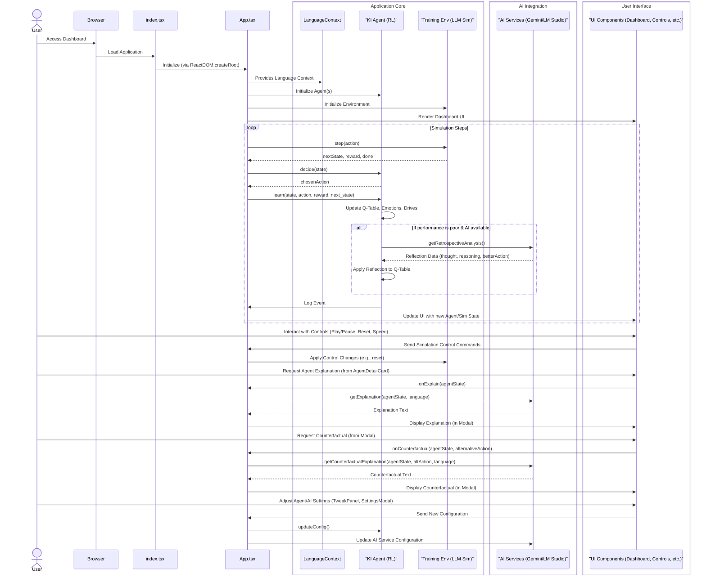

# Run and deploy your AI Studio app

This contains everything you need to run your app locally.

## Run Locally

**Prerequisites:**  Node.js

1. Install dependencies:
   `npm install`
2. Set the `GEMINI_API_KEY` in [.env.local](.env.local) to your Gemini API key
3. Run the app:
   `npm run dev`
# Der Meta-Controller: Ein Blick hinter die Kulissen der KI-Optimierung

Von: Ralf Krümmel

---

Durch die rasante Entwicklung der Künstlichen Intelligenz, insbesondere im Bereich der Large Language Models (LLMs), stehen wir vor der Herausforderung, die internen Prozesse und Entscheidungen dieser komplexen Systeme nachvollziehbar zu machen. Ralf Krümmel nimmt Sie mit auf eine Reise hinter die Kulissen des „Reinforcement Learning Agent Dashboard“, einer Anwendung, die nicht nur die Funktionsweise eines KI-Agenten simuliert, sondern auch seine „Gedanken“ und „Emotionen“ offenbart, während er die Hyperparameter eines trainierenden LLMs optimiert.

### Die Notwendigkeit der Transparenz im Meta-Learning

Moderne KI-Systeme, insbesondere solche, die durch Reinforcement Learning (RL) lernen, agieren oft als „Black Boxes“. Ihre Entscheidungen sind schwer zu interpretieren, was das Vertrauen und die Fehlerbehebung erschwert. Diese Problematik verstärkt sich im Kontext des Meta-Learnings, wo ein KI-Agent (der „Meta-Controller“) die Trainingsparameter eines anderen, komplexen KI-Modells, wie eines LLMs, dynamisch anpasst. Wie können wir verstehen, warum der Meta-Controller die Lernrate eines LLM zu einem bestimmten Zeitpunkt erhöht oder senkt? Und wie kann der Meta-Controller selbst aus seinen Fehlern lernen?

Das „Reinforcement Learning Agent Dashboard“ wurde geschaffen, um diese Fragen zu beantworten. Es transformiert die abstrakte Welt der Hyperparameter-Optimierung in eine interaktive und visuell zugängliche Erfahrung, die es Entwicklern und Forschern ermöglicht, die Lernprozesse des Meta-Controllers in Echtzeit zu beobachten, zu beeinflussen und zu interpretieren.

### 1. Das Herzstück: Der Meta-Controller-Agent

Im Zentrum des Dashboards steht der `KI_Agent`, unser Meta-Controller. Anders als traditionelle RL-Agenten, die sich in physischen Umgebungen bewegen, agiert dieser Agent in einem abstrakten Raum der Modelloptimierung. Seine „Aktionen“ sind Entscheidungen, die direkten Einfluss auf den Trainingsprozess eines simulierten LLMs haben. Konkret kann der Agent die Lernrate des LLM verringern (Aktion 0), beibehalten (Aktion 1) oder erhöhen (Aktion 2).

Was diesen Agenten besonders macht, ist sein komplexes Innenleben:

*   **Emotionen (`EmotionModel`):** Der Agent verfügt über ein rudimentäres emotionales Modell, das Metriken wie Valenz (Angenehm/Unangenehm), Aktivierung (Ruhig/Aufgeregt) und Dominanz (Unterwürfig/Kontrollierend) basierend auf erhaltenen Belohnungen und der Vorhersagbarkeit der Umgebung aktualisiert. Diese „Emotionen“ beeinflussen subtil sein Explorationsverhalten.
*   **Antriebe (`SelfModel`):** Neben den Emotionen hat der Agent intrinsische Antriebe wie Neugier, Verständnis und Frustration. Diese Triebe steuern seine übergeordneten Ziele. Wenn beispielsweise die Frustration einen bestimmten Schwellenwert überschreitet, kann das Ziel des Agenten von „Training optimieren“ zu „Frustration reduzieren“ wechseln, was zu einer impulsiveren Exploration führt.
*   **Q-Learning:** Die Kernlogik des Agenten basiert auf Q-Learning. Er lernt eine Q-Tabelle, die für jeden diskretisierten Trainingszustand die erwarteten Belohnungen für jede mögliche Aktion speichert. Der Agent wählt die Aktion mit dem höchsten Q-Wert, es sei denn, die Explorationsrate (Epsilon) führt zu einer zufälligen Wahl.
*   **Metakognition:** Eine faszinierende Fähigkeit ist die Metakognition. Der Agent überwacht seine eigene Performance über ein gleitendes Fenster der erhaltenen Belohnungen. Bei anhaltend schlechter Leistung kann er in einen „verwirrten“ Zustand (`isConfused`) wechseln, der seine Explorationsrate zusätzlich erhöht, um aus der Sackgasse zu finden.
*   **Retrospektive Reflexion:** Ein Highlight ist die Fähigkeit des Agenten zur Selbstverbesserung. Wenn eine Entscheidung zu einem schlechten Ergebnis führt, kann der Agent einen externen KI-Dienst (siehe Abschnitt 3) um eine retrospektive Analyse bitten. Die empfangenen „Reflexionen“ – bestehend aus einem „Gedanken“, einer „Begründung“ und einer „besseren Aktion“ – werden genutzt, um die Q-Werte direkt anzupassen. Dies ist ein entscheidender Schritt in Richtung adaptiver und autonomer KI-Systeme, die aus ihren eigenen Fehlern lernen.

### 2. Die Bühne des Lernens: Eine simulierte LLM-Trainingsumgebung

Um den Meta-Controller zu trainieren, benötigt er eine Umgebung, mit der er interagieren kann. Die `TrainingEnvironment` simuliert in diesem Dashboard einen vereinfachten, aber realistischen Prozess des LLM-Trainings. Sie ist die „Bühne“, auf der der Agent seine Entscheidungen trifft und deren Auswirkungen beobachtet.

Der „Zustand“ der Umgebung wird nicht mehr durch eine 2D-Position beschrieben, sondern durch einen Vektor von entscheidenden Trainingsmetriken:

*   **Validierungsverlust (`validationLoss`):** Misst, wie gut das LLM auf ungesehenen Daten performt. Ziel des Agenten ist es, diesen Wert zu minimieren.
*   **Verlusttrend (`lossTrend`):** Zeigt an, ob der Validierungsverlust zunimmt, abnimmt oder stagniert.
*   **Aktuelle Lernrate (`learningRate`):** Der Hyperparameter, den der Agent direkt beeinflusst.

Die Umgebung reagiert auf die Aktionen des Agenten, indem sie die Lernrate anpasst und einen neuen Validierungsverlust berechnet, der einem realistischen parabelförmigen Verlauf folgt (mit Rauschen und einem leichten Abwärtstrend, der den Trainingsfortschritt simuliert). Die „Belohnung“ des Agenten ist direkt an die Veränderung des Validierungsverlusts gekoppelt: Ein sinkender Verlust führt zu einer positiven Belohnung, ein steigender Verlust zu einer negativen. Dies treibt den Agenten an, die optimalen Lernraten zu finden.

Ein entscheidender Schritt für den Agenten ist die Diskretisierung dieses kontinuierlichen Zustandsvektors. Die Hilfsfunktion `discretizeTrainingState` wandelt die numerischen Metriken in eine aussagekräftige Zeichenkette um (z.B. „loss_high_trend_inc_lr_low“), die als Schlüssel in der Q-Tabelle des Agenten dient. Dies ermöglicht es dem Agenten, über Kategorien von Trainingszuständen zu lernen, anstatt über exakte, fluktuierende Zahlenwerte.

### 3. Die Brücke zur Verständlichkeit: KI-gestützte Erklärbarkeit (XAI)

Die Integration externer Large Language Models (LLMs) über die `AI_Services` ist ein Game-Changer für die Transparenz dieses Systems. Sie ermöglicht es uns, die Entscheidungen des Meta-Controller-Agenten in menschlich verständlicher Sprache zu erklären und sogar kontrafaktische Szenarien zu erforschen.

Das Dashboard unterstützt zwei KI-Anbieter:

*   **Google Gemini:** Eine direkte Anbindung an die leistungsstarken Generative AI Modelle von Google.
*   **LM Studio:** Ermöglicht die Nutzung lokaler LLMs, die über die LM Studio-Anwendung bereitgestellt werden. Dies bietet Flexibilität und Datenschutz, da keine externen API-Aufrufe erforderlich sind.

Die `IAiService`-Schnittstelle standardisiert drei zentrale XAI-Funktionen:

*   **`getExplanation(agentState, language)`:** Auf Knopfdruck liefert diese Funktion eine detaillierte Erklärung, *warum* der Agent seine letzte Aktion gewählt hat. Die KI analysiert den internen Zustand des Agenten (Emotionen, Antriebe, Q-Werte, Ziele) und den Trainingskontext des LLM (Verlust, Trend, Lernrate), um eine kohärente Begründung zu generieren.
*   **`getCounterfactualExplanation(agentState, alternativeAction, language)`:** Diese Funktion erlaubt es, „Was wäre wenn“-Fragen zu stellen. Wenn der Agent beispielsweise die Lernrate erhöht hat, können wir fragen, was passiert wäre, wenn er sie stattdessen verringert hätte. Die KI prognostiziert dann das wahrscheinlichste Ergebnis und begründet es, basierend auf den verfügbaren Daten.
*   **`getRetrospectiveAnalysis(agentState, outcomeReward, language)`:** Diese Funktion ist der Schlüssel zur Selbstverbesserung des Agenten. Wenn der Agent eine Entscheidung trifft, die zu einer schlechten Belohnung führt, wird dieser Dienst aktiviert. Die KI analysiert die Situation und schlägt eine „bessere Aktion“ vor, zusammen mit einem kurzen „Gedanken“ und einer „Begründung“. Diese Informationen werden direkt in die Q-Tabelle des Agenten zurückgespeist, wodurch er aus seinen Fehlern lernt und seine Strategie anpasst.

Diese XAI-Funktionen sind entscheidend, um Vertrauen in autonome KI-Systeme aufzubauen und den Debugging-Prozess zu beschleunigen. Sie verwandeln die abstrakten Zahlen und Algorithmen in nachvollziehbare Erzählungen.

### 4. Die Benutzeroberfläche: Ein Fenster zur KI-Seele

Die Benutzeroberfläche des Dashboards ist intuitiv gestaltet und bietet einen umfassenden Überblick über die Simulation und den Agenten:

*   **Steuerung (`ControlPanel`):** Hier können Sie die Simulation starten, pausieren, zurücksetzen und die Geschwindigkeit anpassen. Eine Anzeige informiert über den aktuellen Trainingslauf und die Epoche.
*   **Meta-Controller-Konfiguration (`TweakPanel`):** Ein Bereich, in dem Sie die Kernparameter des RL-Agenten in Echtzeit anpassen können: Lernrate, Diskontierungsfaktor, Explorationsrate, Frustrationsschwelle und die Reflexions-Lernrate. Änderungen hier wirken sich sofort auf das Verhalten des Agenten aus.
*   **LLM-Trainingsleistung (`TrainingMonitor`):** Ein dynamisches Diagramm visualisiert den Validierungsverlust des simulierten LLM über die Epochen hinweg. Dies ist die zentrale Metrik, die der Agent zu optimieren versucht.
*   **Meta-Learning-Logs (`LogPanel`):** Ein Echtzeit-Protokoll aller wichtigen Ereignisse – von Systemmeldungen über Agentenentscheidungen bis hin zu KI-Service-Interaktionen. Dies ist ein unverzichtbares Werkzeug zur Nachverfolgung des Simulationsverlaufs und zur Fehleranalyse. Logs können auch exportiert werden.
*   **Meta-Controller Agent-Details (`AgentDashboard`, `AgentDetailCard`):** Der Kern der Visualisierung. Hier werden die internen Zustände des Agenten detailliert dargestellt: seine Emotionen (Valenz, Aktivierung, Dominanz), seine Antriebe (Neugier, Verständnis, Frustration) und seine aktuellen Q-Werte für jede mögliche Aktion. Auch die Liste der kritischen Reflexionen ist hier einsehbar.
*   **KI-Anbieter-Einstellungen (`SettingsModal`):** Ein separates Modal, das die Konfiguration von Google Gemini oder LM Studio ermöglicht, einschließlich API-Schlüsseln und Basis-URLs für lokale Modelle.

### 5. Technische Tiefen und die Magie unter der Haube

Das Dashboard ist als moderne Single-Page Application (SPA) mit [React](https://react.dev/) und [TypeScript](https://www.typescriptlang.org/) implementiert, was eine robuste und wartbare Codebasis gewährleistet. [Vite](https://vitejs.dev/) dient als schneller Build-Tool, und das Styling wird durch [Tailwind CSS](https://tailwindcss.com/) (eingebunden via CDN in der `index.html`) ermöglicht.

Die Internationalisierung (`i18n/LanguageContext.tsx`) erlaubt die nahtlose Umschaltung zwischen Deutsch und Englisch, wodurch die Anwendung einem breiteren Publikum zugänglich gemacht wird.

Das folgende Architekturdiagramm veranschaulicht die Hauptkomponenten der Anwendung und ihre Interaktionen, vom Benutzer bis zu den tiefsten Schichten der KI-Integration:

### Fazit und Ausblick

Das „Reinforcement Learning Agent Dashboard“ ist mehr als nur eine technische Demonstration; es ist ein Fenster in die komplexen adaptiven Prozesse von KI-Systemen. Es bietet nicht nur die Möglichkeit, einen Meta-Learning-Agenten bei der Arbeit zu beobachten, sondern auch, seine Motivationen und Lernschritte zu verstehen – von seinen „Emotionen“ bis hin zu seinen „Reflexionen“.

Die Integration von erklärbarer KI ist ein entscheidender Schritt zur Schaffung transparenterer und vertrauenswürdigerer autonomer Systeme. Die Fähigkeit des Agenten, mittels externer KI-Dienste aus seinen eigenen Fehlern zu lernen und seine Strategie anzupassen, weist den Weg zu einer neuen Generation von selbstverbessernden Algorithmen.

**Zukünftige Perspektiven:**

*   **Komplexere Umgebungen:** Die simulierte LLM-Trainingsumgebung könnte erweitert werden, um mehr Hyperparameter, verschiedene Optimierungsalgorithmen und realitätsnähere Trainingsdynamiken abzubilden.
*   **Fortgeschrittene XAI-Methoden:** Die Erforschung weiterer Erklärungsansätze, wie z.B. die Identifizierung der wichtigsten Zustandsmerkmale für eine Entscheidung (Feature Attribution), könnte die Interpretierbarkeit weiter vertiefen.
*   **Multi-Agenten-Systeme:** Das Dashboard könnte erweitert werden, um Interaktionen zwischen mehreren Meta-Controllern zu simulieren, die gemeinsam oder wettbewerbsorientiert LLM-Trainings optimieren.
*   **Anbindung an reale ML-Plattformen:** Eine direkte Integration mit echten Machine Learning Frameworks (z.B. TensorFlow, PyTorch) oder Cloud-ML-Diensten würde die Anwendung zu einem mächtigen Werkzeug für die reale Hyperparameter-Optimierung machen.

Das „Reinforcement Learning Agent Dashboard“ ist somit nicht nur ein Werkzeug zur Analyse, sondern auch eine Plattform für die Erforschung und Entwicklung der nächsten Generation intelligenter, transparenter und adaptiver KI-Systeme.

---

*Dieser Artikel wurde von Ralf Krümmel verfasst und mit Hilfe von künstlicher Intelligenz erstellt.*
